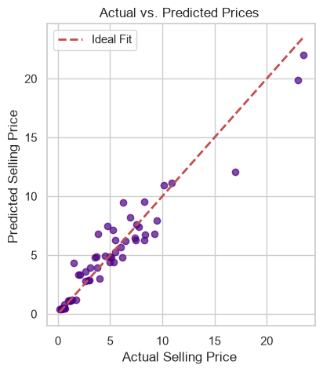
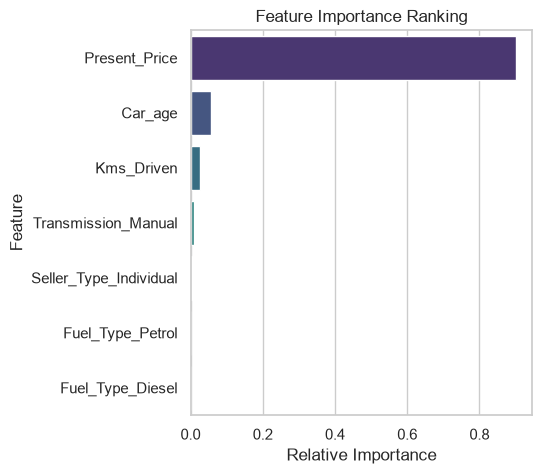
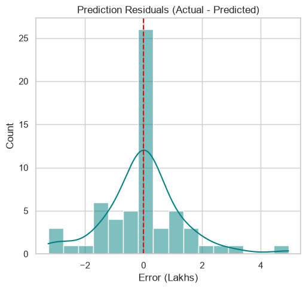

# Used Car Price Prediction Engine

A machine learning pipeline designed to estimate used car resale prices based on vehicle specifications and market attributes. This project compares **Linear Regression** and **Random Forest Regressor** models, evaluates cross-validation reliability, and analyzes key feature importances driving vehicle valuation.

---

## Overview

Predicting resale values accurately is essential for both buyers and sellers in the automotive industry. This project utilizes a dataset containing physical and operational parameters of used cars—such as original showroom price, age, mileage, fuel type, and transmission—to predict continuous resale prices in Lakhs.

### Key Objectives
* Perform feature engineering to transform raw temporal attributes into predictive features (`Car_age`).
* Handle high-cardinality categorical data safely by dropping uninformative unique identifiers.
* One-Hot Encode categorical attributes (`Fuel_Type`, `Seller_Type`, `Transmission`).
* Train and compare baseline linear and non-linear regression models.
* Analyze cross-validation behavior and feature importance rankings.

---

## Dataset Attributes

| Column Name | Type | Description |
| :--- | :--- | :--- |
| `Car_Name` | Text | Model/Make name *(Dropped due to high cardinality)* |
| `Year` | Numeric | Year of purchase *(Engineered into `Car_age`)* |
| `Selling_Price` | Numeric | Target variable: Resale price (in Lakhs) |
| `Present_Price` | Numeric | Current ex-showroom/original price (in Lakhs) |
| `Kms_Driven` | Numeric | Total distance driven in kilometers |
| `Fuel_Type` | Categorical | Petrol / Diesel / CNG |
| `Seller_Type` | Categorical | Dealer / Individual |
| `Transmission` | Categorical | Manual / Automatic |
| `Owner` | Numeric | Number of previous owners |

---

## Tech Stack & Libraries

* **Language:** Python 3.x
* **Data Processing:** Pandas, NumPy
* **Machine Learning:** Scikit-Learn (`LinearRegression`, `RandomForestRegressor`, `train_test_split`, `cross_val_score`, `metrics`)

---

## Workflow & Pipeline

1. **Feature Engineering:** Calculated `Car_age` using the formula `2026 - Year` to better capture value depreciation.
2. **Preprocessing:** Applied One-Hot Encoding (`pd.get_dummies`) on categorical variables and dropped redundant features.
3. **Model Evaluation:** Split data into 80% training and 20% testing sets. Evaluated performance using Mean Squared Error (MSE) and $R^2$ Score.
4. **Validation:** Executed 5-Fold Cross-Validation to test model stability across multiple data splits.
5. **Feature Importance:** Analyzed tree-based feature importances to identify key price drivers.

---
## Model Evaluation & Visualizations

| Actual vs Predicted | Feature Importance | Error Distribution |
| :---: | :---: | :---: |
|  |  |  |

## Performance Summary

| Model | Mean Squared Error (MSE) | $R^2$ Score |
| :--- | :--- | :--- |
| **Linear Regression** | ~8.35 | ~0.84 |
| **Random Forest Regressor** | ~5.30 | ~0.90 |

> **Key Finding:** The **Random Forest Regressor** outperforms Linear Regression by effectively modeling non-linear depreciation trends. `Present_Price` and `Car_age` emerge as the dominant factors influencing resale value.

---

## Usage

1. Clone the repository:
   ```bash
   git clone [https://github.com/UmarMujahid07/python-projects.git](https://github.com/UmarMujahid07/python-projects.git)
   cd python-projects/08_Vehicle_Resale_Price_Estimator